# E444-F2025-PRA2
## This repo is a clone of https://github.com/miguelgrinberg/flasky

# PRA2 Part 1 - Flask
## Activity 1.1
### Installation

 
  <kbd>
    <a href="https://JohnBoulanger.github.io" target="_blank">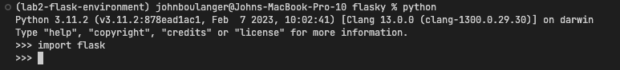
  </a>
  </kbd>

## Activity 1.2
### Textbook example chapter 2

 
  <kbd>
    <a href="https://JohnBoulanger.github.io" target="_blank">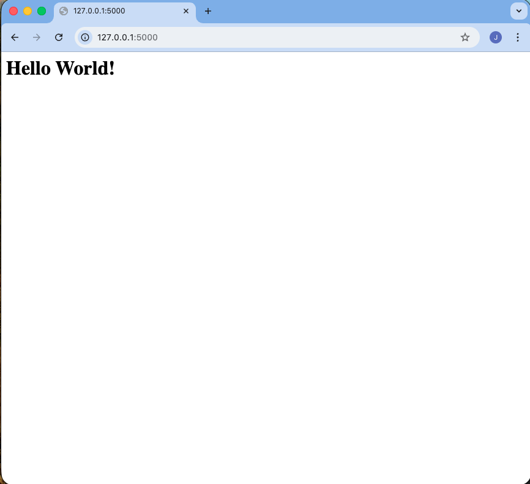
  </a>
  </kbd>

 
  <kbd>
    <a href="https://JohnBoulanger.github.io" target="_blank">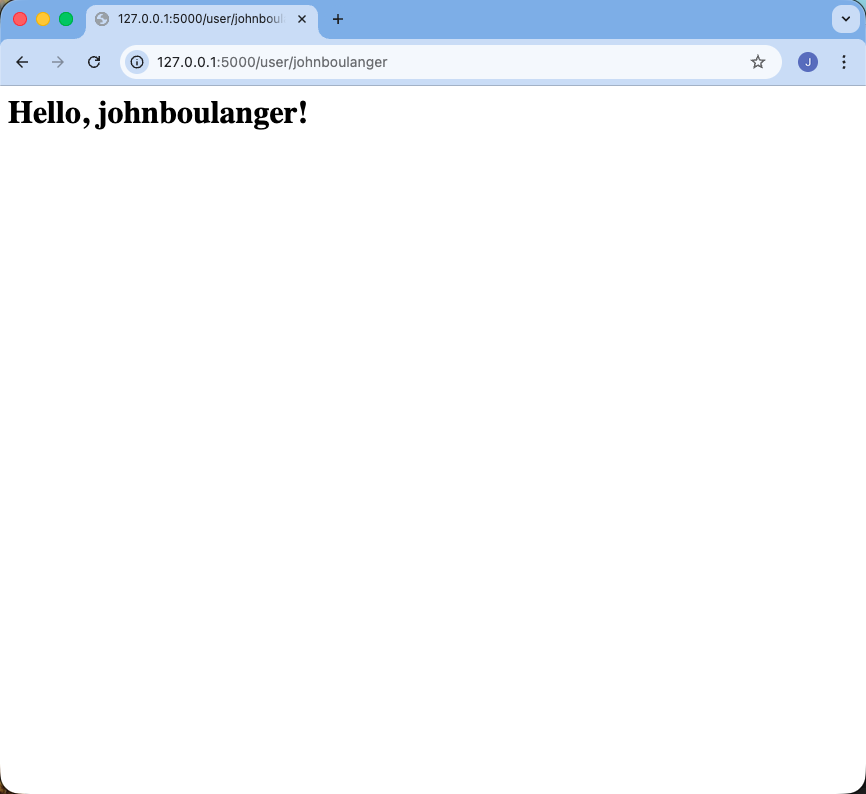
  </a>
  </kbd>

## Activity 1.3
### Textbook example chapter 3

 
  <kbd>
    <a href="https://JohnBoulanger.github.io" target="_blank">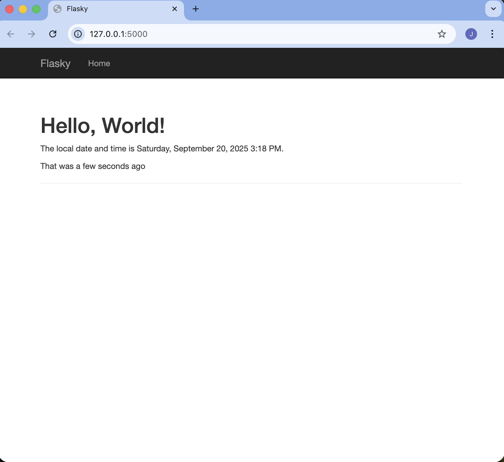
  </a>
  </kbd>

## Activity 1.4
### Textbook example chapter 4

 
  <kbd>
    <a href="https://JohnBoulanger.github.io" target="_blank">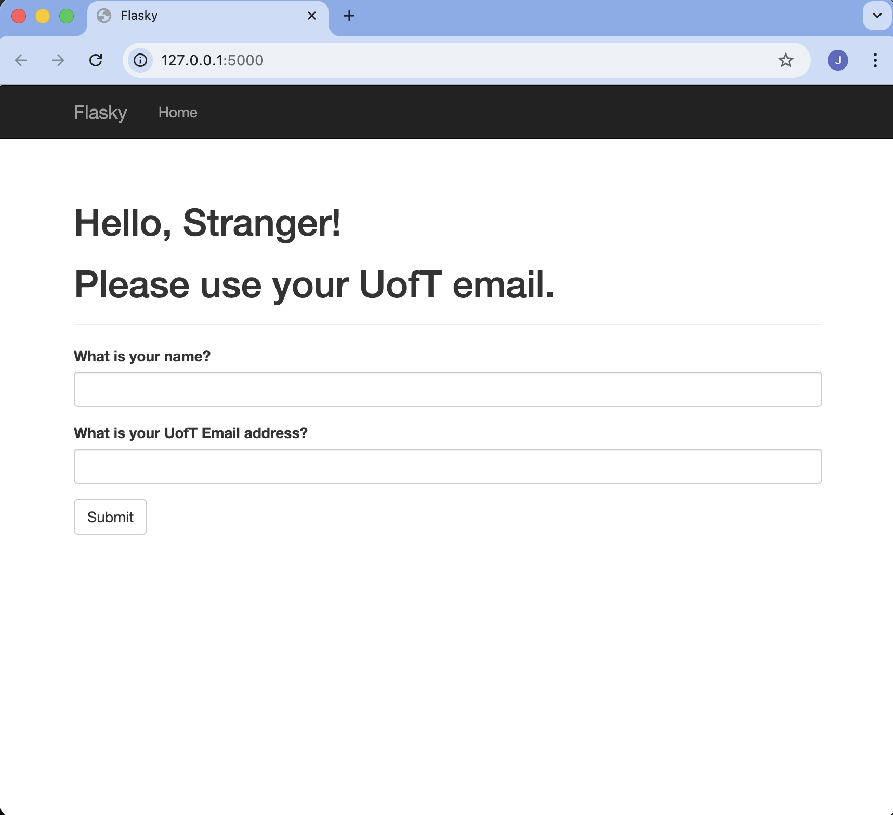
  </a>
  </kbd>

 
  <kbd>
    <a href="https://JohnBoulanger.github.io" target="_blank">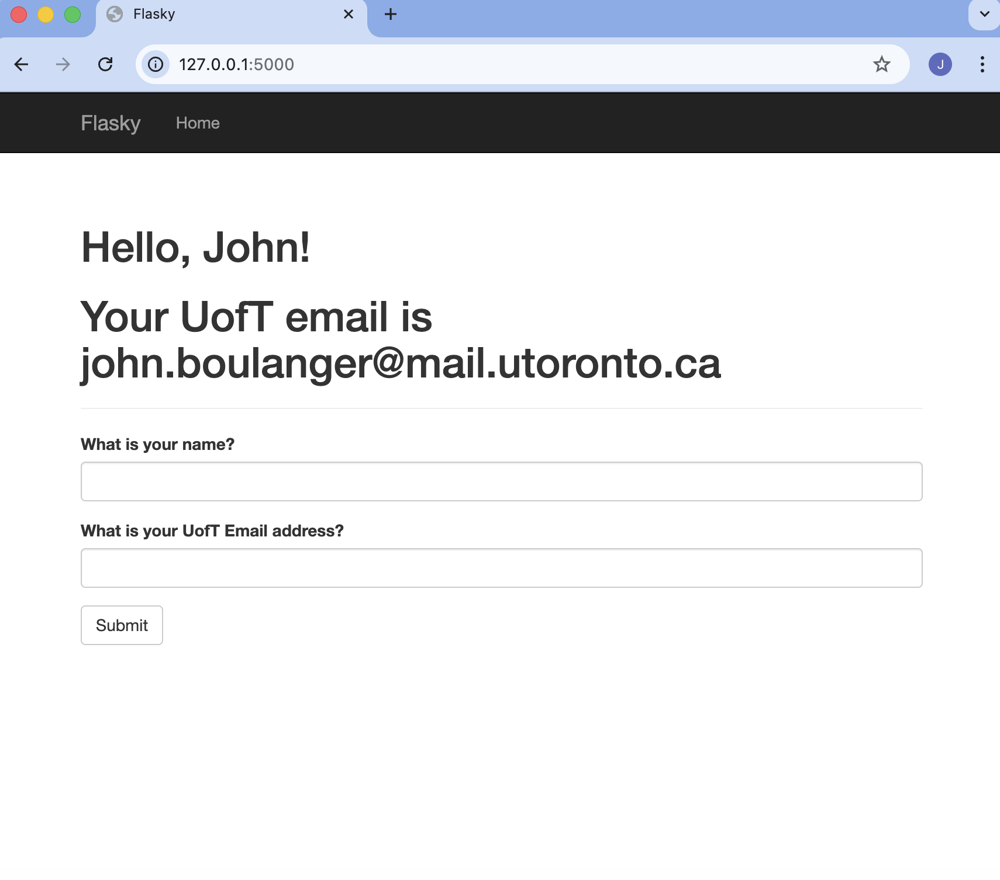
  </a>
  </kbd>

 
  <kbd>
    
  </kbd>

 
  <kbd>
    <a href="https://JohnBoulanger.github.io" target="_blank">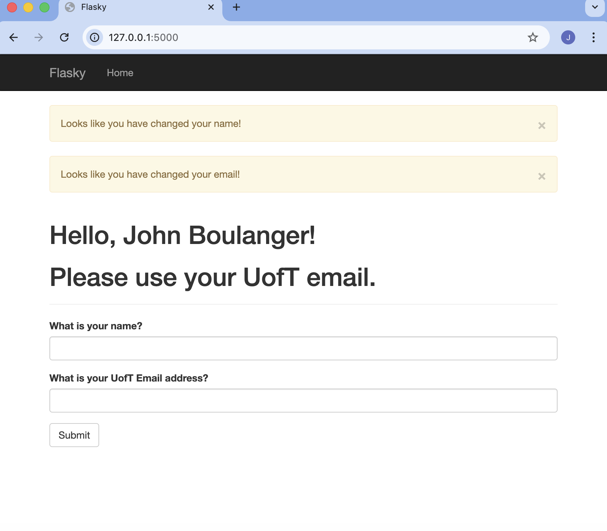
  </a>
  </kbd>

# PRA2 Part 2 - Docker
## Activity 2.1
### Create PRA2_2 Branch

 
  <kbd>
    <a href="https://JohnBoulanger.github.io" target="_blank">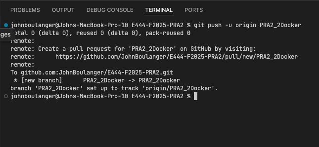
  </a>
  </kbd>

## Activity 2.2
### Docker Installation

 
  <kbd>
    <a href="https://JohnBoulanger.github.io" target="_blank">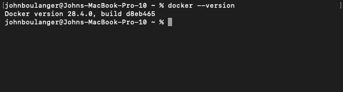
  </a>
  </kbd>

## Activity 2.3
### Get Things Ready Locally

 
  <kbd>
    <a href="https://JohnBoulanger.github.io" target="_blank">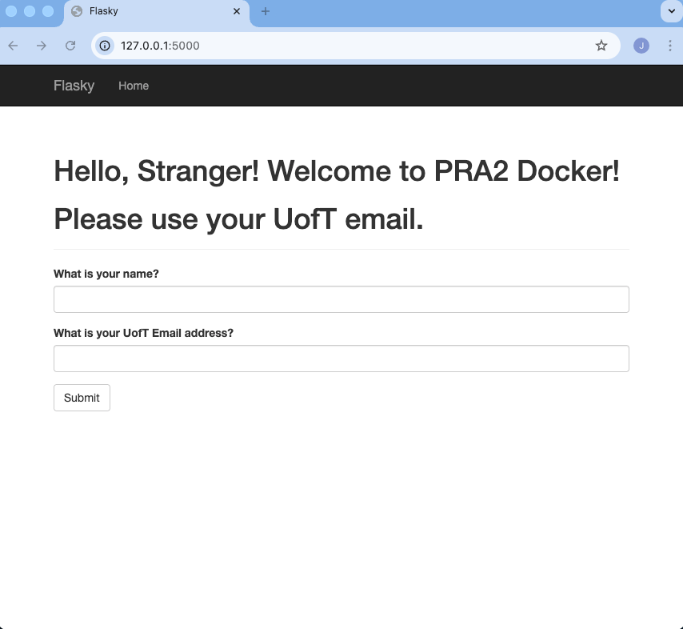
  </a>
  </kbd>

## Activity 2.4
### Build and Run Docker Image Locally

 
  <kbd>
    <a href="https://JohnBoulanger.github.io" target="_blank">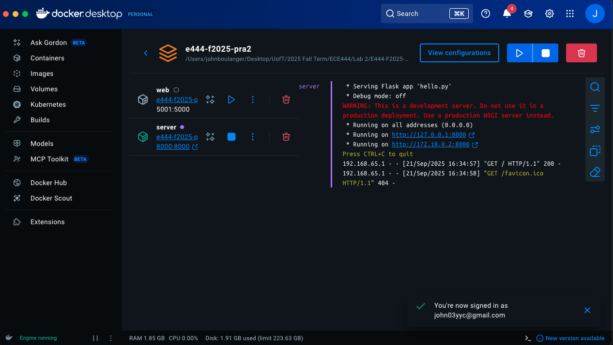
  </a>
  </kbd>

 
  <kbd>
    
  </kbd>

